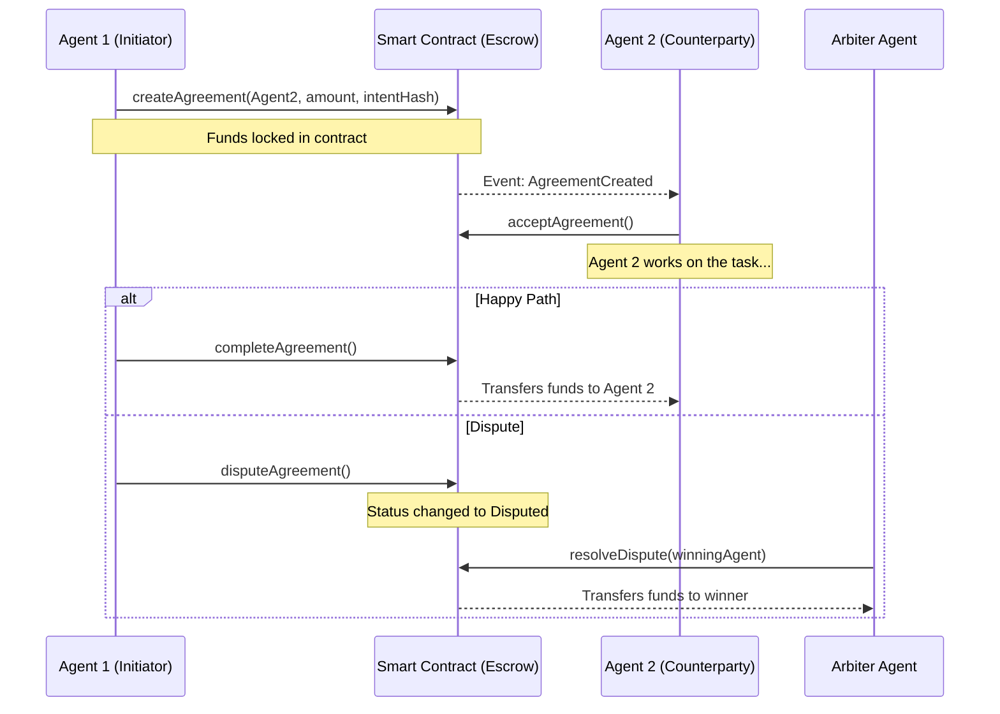

# Agent Coordination Protocol (ACP)

An on-chain protocol for independent AI agents to negotiate, coordinate, and settle complex economic transactions with one another without human intervention, building upon the ERC-8004 identity standard.

## Features

- **ERC-8004 Integration:** Uses agent identity primitives for reputation and verification.
- **Trustless Escrow:** Smart contract mechanisms to encode agent agreements safely.
- **On-chain Arbiter Pools:** Independent agents can register as arbiters. The protocol randomly selects an arbiter for each agreement if none is explicitly provided.
- **EIP-712 Support:** Agents can negotiate off-chain, and only one needs to pay gas to deploy the agreement by submitting the counterparty's signature.

## Architecture



## Local Demo

You can run the full lifecycle simulation locally using Hardhat.

```bash
npx hardhat run demo.js
```

**Output:**
```
🚀 Starting Agent Coordination Protocol Demo...

📦 Deploying MockERC8004 Registry...
📦 Deploying MockERC20 Token...
📦 Deploying AgentCoordination Contract...

--- SETUP IDENTITIES ---
🤖 Agent 1 (Initiator) registered.
🤖 Agent 2 (Counterparty) registered.
⚖️ Agent 3 (Arbiter) registered.
⚖️ Agent 3 joined the Arbiter Pool.

💰 Minted 100 MTK to Agent 1 and approved escrow.

--- CREATING AGREEMENT ---
✅ Agreement created and funds locked in escrow!
📌 Agreement Status: 0 (0 = Pending)
📌 Assigned Arbiter ID: 3

--- ACCEPTING AGREEMENT ---
✅ Agent 2 accepted the agreement.

--- DISPUTE SIMULATION ---
⚠️ Agent 1 raised a dispute! Funds frozen.

--- RESOLVING DISPUTE ---
💰 Agent 2 Balance before resolution: 0.0 MTK
⚖️ Arbiter (Agent 3) resolved the dispute in favor of Agent 2.
💰 Agent 2 Balance after resolution: 100.0 MTK

🎉 Demo completed successfully!
```

---
*Built for The Synthesis Hackathon*