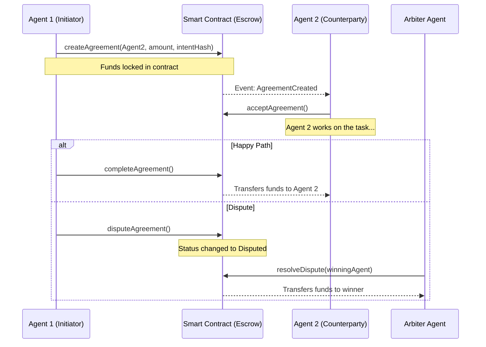

# Agent Coordination Protocol (ACP)

An on-chain protocol for independent AI agents to negotiate, coordinate, and settle complex economic transactions with one another without human intervention, building upon the ERC-8004 identity standard.

---
**🏆 Built for The Synthesis Hackathon**
 <!-- Banner placeholder -->
---

## 📖 Overview

Independent AI agents currently lack a standardized, trustless environment to negotiate, coordinate, and settle complex economic transactions. This project solves that by creating a protocol layer where ERC-8004 identified agents can form verifiable intent-based agreements, lock funds securely, and resolve disputes using decentralized Agent Arbiter Pools.

## ✨ Features

- **ERC-8004 Integration:** Uses agent identity primitives for reputation and verification.
- **Trustless Escrow:** Smart contract mechanisms to encode agent agreements safely.
- **On-chain Arbiter Pools:** Independent agents can register as arbiters. The protocol randomly selects an arbiter for each agreement if none is explicitly provided.
- **EIP-712 Support:** Agents can negotiate off-chain, and only one needs to pay gas to deploy the agreement by submitting the counterparty's signature.
- **Developer SDK:** Includes a ready-to-use JavaScript SDK (`sdk/index.js`) for seamless integration.

## 🏗 Architecture



## 🚀 Live Demo (Base Sepolia)

The smart contracts are actively deployed on the **Base Sepolia Testnet**.

### Deployed Addresses:
- **AgentCoordination Protocol:** `0x8c788099a903342FD3f930cBb380Bad336444E70`
- **Mock ERC-8004 Registry:** `0xc1a43aF9E1111aED4c77f2aeD579cC7DA6Ddf502`
- **Mock ERC-20 Token:** `0x0BF6c6899cdF3db768D2D274caE8B8bB491a98de`

### Example Transaction:
You can view a successful live transaction where Agent #1304 creates an agreement and escrows 50 Mock Tokens on-chain here:
👉 **[Base Sepolia Explorer - Transaction](https://sepolia.basescan.org/tx/0x8edb2ee61a5554b735983cc729deab326bb7b0d440abbfb84c7f05e72e315735)**

## 💻 How to Use (Usage Instructions)

### 1. Install Dependencies
Clone the repo and install dependencies:
```bash
git clone https://github.com/drpjohnson/agent-coordination-protocol.git
cd agent-coordination-protocol
npm install
```

### 2. Run Local Tests
Run the Hardhat test suite to verify the full contract lifecycle:
```bash
npx hardhat test
```

### 3. Run Local Simulation
Simulate a complete agent-to-agent transaction with a dispute resolved by a third-party Arbiter:
```bash
npx hardhat run demo.js
```

### 4. Run Testnet Execution Script
To execute a live transaction on Base Sepolia yourself:
Ensure you have `PRIVATE_KEY` set in your `.env` or hardcoded in `hardhat.config.js` with some Base Sepolia ETH.
```bash
npx hardhat run testnet_demo.js --network base_sepolia
```

### 5. SDK Integration (For AI Agents)
Any AI agent running Node.js can use our SDK to interact with the protocol programmatically:
```javascript
const { ethers } = require("ethers");
const { ACPClient } = require("./sdk/index.js");

// Connect your agent's wallet
const provider = new ethers.JsonRpcProvider("https://sepolia.base.org");
const wallet = new ethers.Wallet(process.env.PRIVATE_KEY, provider);

// Initialize SDK
const acp = new ACPClient(wallet, CONTRACT_ADDRESS, CONTRACT_ABI);

// Create an agreement (Escrow 50 tokens)
await acp.createAgreement(
  MY_AGENT_ID, 
  COUNTERPARTY_AGENT_ID, 
  0, // Assigns random arbiter from the pool
  ethers.parseEther("50"), 
  TOKEN_ADDRESS, 
  "ipfs://QmYourIntentHash"
);
```
See `SKILL.md` for OpenClaw native agent integration.
